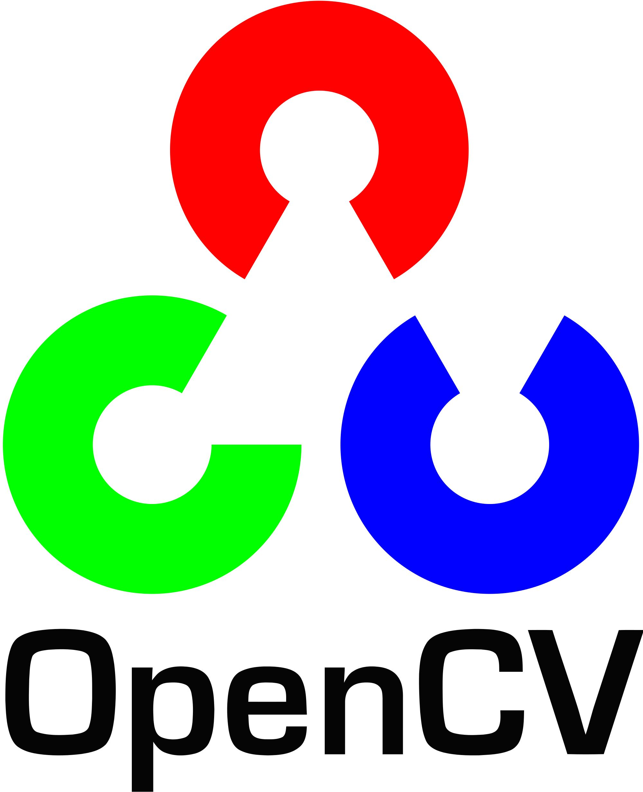

# 图像处理工具软件

[TOC]

## 项目介绍

> 本项目打算设计一个图像处理程序，能够实现基本的图像处理工作，同时附带一些高级功能。**我们主要的实现平台在windows操作系统上。**为加强用户体验，我们采用全图形界面设计，方便程序与用户交互。
>
> **为了小组成员代码沟通的方便，我们项目开发全程都将代码托管在Github上，Github地址为：https://github.com/ZJUOOP/ImageProcess**
>
> 为了便于方便大家更加快速地安装QT、OpenCV，配置编译环境，了解这些第三方库的特性，我也特地写了一些Blog（教程），并放在了我的个人网站上，内容包括但不局限于以下文章：
>
> - [浅谈Qt5中的事件处理机制](http://www.alanshaw.cn/articles/qt-event.html)
> - [opencv3.3+qt5.9.3配置](http://www.alanshaw.cn/articles/opencv-demo.html)

### IDE介绍

####    QT Creator 4.4.1(Community)


**Qt Creator** 是一款跨平台的集成开发环境，特别针对Qt开发者，是QtSDK组成的一部分，可运行于Windows, Linux/X11及Mac OS X等桌面操作系统，允许开发者为多桌面环境及移动设备平台创建应用程序。它包括一个可视化调试工具和集成的 GUI 版面和外形设计师。这个编辑器的功能包括语法高亮度显示和自动完成。在 Windows，默认安装它可以使用 MinGW 或 MSVC。从源代码编译时，也可以使用 cdb。

Qt Creator的**代码编辑器**用于辅助创建，编辑，浏览代码，具有对C++及QML语言完整的表达式检查，代码补全，上下文关联，键入代码时的行间错误即时指示等功能：

- 使用C ++，QML和ECMAscript支持的代码编辑器
- 快速代码导航工具
- 语法突出显示和代码完成
- 您键入时的静态代码检查和样式提示
- 支持源代码重构
- 上下文相关帮助
- 代码折叠
- 括号匹配和括号选择模式

Qt Creator 提供两个集成的可视化编辑器，**Qt Designer** 与 **Qt Quick Designer**。

**调试器**方面，C ++的可视化调试器能够解释许多Qt类的结构，从而增加了提示Qt各种类和对象的能力。另外，Qt Creator以清晰简洁的方式显示GDB的原始信息。

- 中断程序执行。
- 逐行执行程序或按指令执行。
- 设置断点。
- 检查调用堆栈内容以及本地和全局变量。

####    Microsoft Visual Studio 2017


**Microsoft Visual Studio**（简称**VS**）是微软公司的开发工具包系列产品。VS是一个基本完整的开发工具集，它包括了整个软件生命周期中所需要的大部分工具，如UML工具、代码管控工具等等。

**Visual Studio 2017**是微软于2017年3月8日正式推出的新版本，是迄今为止 最具生产力 的 Visual Studio 版本。

<u>它有以下的一些特性，可以帮助我们在处理大型第三方库（如QT,OpenCV）时有着良好的体验，方便了我们在写这个图形应用程序时，面对大量的函数不知道用法时尴尬的处境。</u>

- **IntelliSense功能**，可以帮助我们在键入函数名时，自动提示这个函数的形参和相应的用法介绍。IntelliSense 随着键入描述 API，并使用自动完成功能以提高速度和精确度。 探索新 API 的速度更快，因为可以通过分类缩小值的范围。 
- **在上下文中导航。**在使用QT这样大型代码库时，进行某个特定函数的查找可能会很困难。 Visual Studio 提供“速览定义”和改进的“定位”功能（方便轻松筛选掉不需要的项，并选择仅查找一种类型的项），有助于更轻松地进行导航，快速定位代码上下文或起始标记。同时，通过解决方案资源管理器中的嵌入式对象浏览方式，可以轻松查看代码的对象结构，并快速搜索解决方案中的文件。
- **CodeLens 功能。**我们可以无需离开代码即可通过 CodeLens 快速了解其调用结构并导航至相关函数。 这可以使得整体结构一目了然，在使用C++这样的OOP语言时，多级继承的类和成员可以方便的检索和查找，极大地方便了我们写代码。
- **查找错误列表中的所有问题。**错误列表可通过“一站式”方式导航并更正解决方案中与代码相关的问题，无论这些问题源自何处，从编译和生成到代码分析全部涵盖在内。使用高级“筛选”专注于问题，导航至该问题并进行修复。在错误上单击“代码链接”或按 F1 键以搜索 Web 内容帮助解决您的问题。

### Complier介绍

####    MSVC 2017

**Microsoft Visual C++2017**（简称Visual C++、MSVC、VC++或VC）是微软公司的C++开发工具，具有集成开发环境，可提供编辑C语言，C++以及C++/CLI等编程语言。VC++集成了便利的除错工具，特别是集成了微软Windows视窗操作系统应用程序接口（Windows API）、三维动画DirectX API，Microsoft .NET框架。目前最新的版本是Microsoft Visual C++ 2017。

Visual C++以拥有语法高亮、IntelliSense（智能提示）以及高级调试功能而著称。比如，它允许我们进行远程调试，单步执行等。**还有允许我们在调试期间重新编译被修改的代码，而不必重新启动正在调试的程序。**其编译及创建预编译头文件（stdafx.h）、最小重建功能及累加链接（link）著称。这些特征明显缩短程序编辑、编译及链接的时间花费，在大型软件项目上尤其显著。

### 库

####    Qt 5.9.2

Qt是一个跨平台的桌面，广泛用于开发GUI程序，这种情况下又被称为部件工具箱。也可用于开发非GUI程序，比如控制台工具和服务器。嵌入式和移动应用程序开发框架。支持的平台包括Linux，OS X，Windows，VxWorks，QNX，Android，iOS，BlackBerry，Sailfish OS等。

Qt本身*不是*一种编程语言。这是一个用C ++编写的框架。预处理器MOC（元对象编译器）用于扩展具有诸如信号和插槽之类特征的C ++语言。在编译之前，MOC解析用Qt-C ++编写的源文件，并从中生成符合标准的C ++源文件。因此，框架本身和使用它的应用程序/库可以通过任何符合标准的C ++编译器（如Clang，GCC，ICC，MinGW和MSVC）进行编译。

Qt的开发始于1990年，由挪威程序员Eirik Chambe-Eng和Haavard Nord开发。他们的公司Trolltech公司出售Qt许可证并提供支持，多年来经历了多次收购。今天，前奇趣科技被命名为Qt公司，是Digia公司的全资子公司。总部位于芬兰。尽管Qt公司是Qt背后的主要驱动力，Qt现在是由一个更大的联盟Qt项目开发的。它由全球许多公司和个人组成，遵循精英管理模式。

####    OpenCV 3.3.1



OpenCV（开源计算机视觉库）是在BSD许可下发布的，因此它在学术和商业上都是免费的。它具有C ++，C，Python和Java接口，支持Windows，Linux，Mac OS，iOS和Android。OpenCV的设计是为了提高计算效率，并将重点放在实时应用程序上。用优化的C / C ++编写，库还可以利用多核处理。通过使用OpenCL，可以利用底层异构计算平台的硬件加速。**（同时，我们这次的应用程序将支持OpenML、intel TBB多核加速）**

OpenCV在世界各地采用，拥有超过4.7万人的用户群，预计下载量超过1400万。是一个大型的计算机视觉库。

OpenCV是开源的应用程序，项目托管在GitHub上面：https://github.com/opencv/opencv。

## 功能目标

### 基本功能

首先，程序要满足基本图片处理工具软件的功能，经过我们的讨论，基本功能如下：

* 能够显示直方图

  > 数码时代，直方图可以说是无处不在。无论是相机的显示屏，还是后期PS、ACR里的窗口，甚至色阶、曲线的工具之中，都可以看到直方图的身影。直方图，准确来说应该叫RGB直方图，因为他是由红、绿、蓝三个通道的直方图叠加后除以3而成的。图像直方图由于其计算代价较小，且具有图像平移、旋转、缩放不变性等众多优点，广泛地应用于图像处理的各个领域，特别是灰度图像的阈值分割、基于颜色的图像检索以及图像分类。


* 可以对图片部分进行选定、模糊、锐化等操作

  > 图像中的像素每一个都有自己的像素值，这些像素值决定了图像最终的显示。
  >
  > 图像模糊的原理，也就是一种像素的平滑化，通过对图像中的像素值进行平均处理，让这些像素值越来越来接近，来达到一种人尽量无法辨识出这些像素点的差别，从来产生模糊的效果。
  >
  > 图像锐化(image sharpening)是补偿图像的轮廓，增强图像的边缘及灰度跳变的部分，使图像变得清晰，分为空域处理和频域处理两类。图像锐化处理的目的是为了使图像的边缘、轮廓线以及图像的细节变的清晰，经过平滑的图像变得模糊的根本原因是因为图像受到了平均或积分运算，因此可以对其进行逆运算（如微分运算）就可以使图像变的清晰。

* 具有一般的图片大小调整、平移、缩放、旋转、分割等功能

* 可以打开、保存图片

* 具有图像（圆、三角形、长方形）的编辑功能

* 对于图片的RGB通道分离、提取等功能

  > 一幅图像的基本组成单位是以RGB为基础展开的，为此可以理解为一个图像由RGB这样的三个元素组成，R为一个红色通道，表示为1；G为一个绿色通道，表示为2；B 为一个蓝色通道，表示为3；有一处白色图像则为4,它是由1、2、3处的通道颜色混合而成，这相当于我们使用的调色板，几种颜色混合在一起将产生一种新的颜色。为了更好的观察一些图像材料的特征，有时需要对RGB三个颜色通道的分量进行分别显示和调整。

### 扩张功能

在基本功能的基础上，我们可以利用`opencv`的c++接口来实现一些扩张的功能，比如：

* 图像压缩

  > 像压缩是指以较少的比特有损或无损地表示原来的像素矩阵的技术，也称图像编码。图像数据之所以能被压缩，就是因为数据中存在着冗余。图像数据的冗余主要表现为：图像中相邻像素间的相关性引起的空间冗余；图像序列中不同帧之间存在相关性引起的时间冗余；不同彩色平面或频谱带的相关性引起的频谱冗余。数据压缩的目的就是通过去除这些数据冗余来减少表示数据所需的比特数。由于图像数据量的庞大,在存储、传输、处理时非常困难,因此图像数据的压缩就显得非常重要。

* 图像的重建

  > 通过物体外部测量的数据，经数字处理获得三维物体的形状信息的技术。从2维图像重建3维立体具有重要的研究价值和潜在经济社会价值，其核心技术是图像的密集匹配。


* 图像的边缘检测

  > 边缘检测的目的是标识数字图像中亮度变化明显的点。图像属性中的显著变化通常反映了属性的重要事件和变化。 这些包括（i）深度上的不连续、（ii）表面方向不连续、（iii）物质属性变化和（iv）场景照明变化。 图像边缘检测大幅度地减少了数据量，并且剔除了可以认为不相关的信息，保留了图像重要的结构属性。漫水填充，经常被用来标记或分离图像中的一部分，以便对其进行进一步的处理或者分析。漫水填充也可以用来从输入图像获取掩码区域，掩码会加速处理过程，或只处理掩码指定的像素点。

* 图像的漫水覆盖

  > 漫水填充是用一定颜色填充联通区域，通过设置可连通像素的上下限以及连通方式来达到不同的填充效果;漫水填充经常被用来标记或分离图像的一部分以便对其进行进一步处理或分析。

* 图像的阈值化

  > 图像阈值分割是一种广泛应用的分割技术，利用图像中要提取的目标区域与其背景在灰度特性上的差异，把图像看作具有不同灰度级的两类区域(目标区域和背景区域)的组合，选取一个比较合理的阈值，以确定图像中每个像素点应该属于目标区域还是背景区域，从而产生相应的二值图像。
  > 阈值分割法的特点是：适用于目标与背景灰度有较强对比的情况，重要的是背景或物体的灰度比较单一，而且总可以得到封闭且连通区域的边界。

* 图像的滤波

  > 由于成像系统、传输介质和记录设备等的不完善，数字图像在其形成、传输记录过程中往往会受到多种噪声的污染。另外，在图像处理的某些环节当输入的像对象并不如预想时也会在结果图像中引入噪声。这些噪声在图像上常表现为一引起较强视觉效果的孤立像素点或像素块。一般，噪声信号与要研究的对象不相关它以无用的信息形式出现，扰乱图像的可观测信息。对于数字图像信号，噪声表为或大或小的极值，这些极值通过加减作用于图像像素的真实灰度值上，对图像造成亮、暗点干扰，极大降低了图像质量。图像滤波，即在尽量保留图像细节特征的条件下对目标图像的噪声进行抑制，是图像预处理中不可缺少的操作，其处理效果的好坏将直接影响到后续图像处理和分析的有效性和可靠性。

### 高级功能

高级功能为现在的基本设想，不直接使用`opencv`接口，自己实现图片高级操作。现在只有一些实现想法，具体操作需要后端程序员继续讨论，目前设想的高级功能有：

* 图片的隐写、分图层查看，如`stegsolve`[软件](https://github.com/zardus/ctf-tools/tree/master/stegsolve)的实现
* 图片的密钥加密、解密功能，兼顾复杂度与算法安全性
* 加入类似美图秀秀软件中的人像处理功能，智能分析人像部分并进行美化，美化包括且不限于磨皮、去红眼、调节面部色彩饱和度等

## 基本实现思路

> 图像处理工具软件的实现分为前端和后端两部分，前端程序员负责直接和用户交互的部分，利用**Qt5.9**实现便于用户操作的可视化图形界面，精确地获取并理解用户的需求，调用相关的后端功能；而后端程序员使用**OpencCV3.3**完成对图片的处理部分，设计一个便于使用、功能强大的图片处理函数库接口，供前端调用。

### 图片处理流程

```
+-------+      +------------+      +----------------------+      +----------------------------------+
| Start | ---> | Load Image | ---> | Get user reqiurement | ---> | Call the corresponding function  |
+-------+      +------------+      +----------------------+      |       to process the image       |
                                               ↑                 +----------------------------------+
                                               |                                        |
                                               | No                                     |
                                               |                                        |
                                               |                                        ↓
  +-----+      +------------+       Yes     +-------+                       +--------------------+
  | End | <--- | Save image | <------------ | Exit? | <----------- -------- | Show the new image |
  +-----+      +------------+               +-------+                       +--------------------+

                                   
```

### 前端编写


- 完成主要的软件架构以及业务逻辑

- 设计美观且便于使用的GUI

- 完成载入和保存图片的功能

- 获取用户的操作信息，调用后端编写的功能函数处理图片

其中GUI可利用**Qt**框架自带的**Qt Designer**，该工具能够直观、便捷地设计出美观的GUI，搭配Qt强大的文档查阅工具**Qt Assistant**，相信能够较为简便地设计出简洁优雅的用户图形界面。在本次软件的编写中，前端人员负责主要的软件架构，这是由于前端程序员对整个软件的功能以及业务逻辑更加了解，同时也能使得前端和后端分离，降低编写过程中的合作难度。后端程序员只需关注功能的实现，而前端程序员只要关心界面的设计以及与用户的互动。

### 后端编写

由于Qt自带的图片存储类`QImage`、`QPixmap`、`QBitmap`、`QPicture`与OpenCV的图片存储类`Mat`不同，需要两个图片格式转换函数：

```
     QImage Mat2Image( Mat &img );
     Mat Image2Mat( QImage &img ); 
```

这两个函数由负责后端的程序员编写，后者在每个图片处理函数返回前调用，转换成可直接适用于Qt的图像。QImage 与QPixmap等Qt图像类的转换由前端程序员决定。

根据实现功能的要求，负责的后端的人使用OpenCV编写相对应的图片处理函数，并封装在一个接口文件中。接口文件要求:

- 有充分的注释，包括函数功能、参数说明和用法示例等
- 为了与Qt和OpenCV代码风格一致，函数名使用大写的驼峰命名法
- 涉及图像输入输出的函数，传入参数类型使用`QImage &`，返回类型为`QImage`
- 接口文件应只包含相应的函数声明，不包括static函数的声明


### 时间线

| 任务            |    DDL     |  负责人员 |
| ------------- | :--------: | ----: |
| 代码风格讨论及确定     | 2017.12.03 |  全体成员 |
| 功能函数接口的确认     | 2017.12.06 |  全体成员 |
| 后端代码的编写、调试及测试 | 2018.01.07 | 后端程序员 |
| 前端代码的编写、调试及测试 | 2018.01.14 | 前端程序员 |
| project文档     | 2018.01.22 |  全体人员 |

### 注意事项

- 在实现功能函数之前，后端程序员需要和前端程序员有充分的交流，并确认函数的接口原型，避免产生接口冲突的情况

- 采用统一的代码风格，由全组人员讨论后制定，不得擅自更改，如果有分歧则少数服从多数

- 代码要有充分的注释，选择有意义的变量名

- 两位后端程序员要先自行测试自己编写的功能函数，通过后相互交换测试，确认没有Bug后方可交给前端程序员

- 保证按照时间线完成相应任务，不得拖延


## 人员职责

| 角色   | 姓名（学号） | 职责   |
| ---- | ------ | ---- |
| 组长   |        |      |
| 组员   |        |      |
| 组员   |        |      |
| 组员   |        |      |

## 附录


